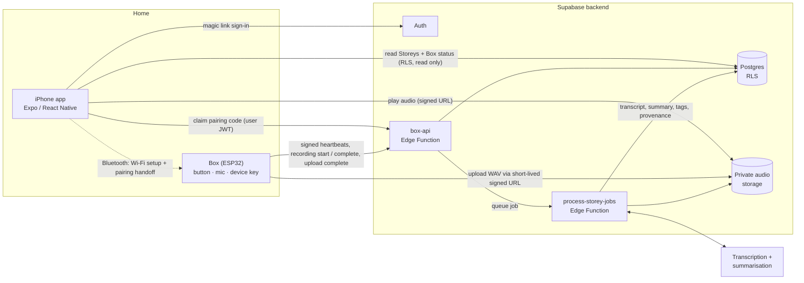

# Storeybox

Storeybox is a hardware-first memory archive. A small physical device, the
**Box**, sits at home and records spoken memories when someone presses it.
A companion iPhone app lets the household browse, search, and play back what
the Box brings home.

This repository is a public description of the project. The application,
backend, and firmware source live in a private repository.

## The one product rule

**The Box records. The app does not.**

The phone app never captures audio. It pairs the Box to an account, shows the
Box's status, and presents the archive. Recording happens only on the Box,
with a physical button, in the room where the memory is told.

## Product language

- **Box** — the physical Storeybox hardware.
- **Storey** — one saved memory: audio playback, transcript, summary, tags,
  emotional texture, memorable quotes, and provenance (which Box, when).
- **Archive** — the collection of Storeys, browsable by time, theme, and
  people.
- **Your Box** — the app surface for pairing, status, and settings.

## How it works

1. A user signs in to the app with a magic link.
2. The user pairs their Box from the app.
3. The Box sends signed heartbeats and status to the backend using
   per-device credentials.
4. When someone presses the Box, it opens a recording session, uploads the
   audio directly to private storage through a short-lived signed URL, and the
   backend queues processing.
5. Processing produces the transcript, summary, tags, and provenance for the
   Storey.
6. The app reads Storeys and Box status through authenticated, row-level
   secured read paths. Hardware writes go through server-side functions,
   never through the app.

## How the pieces talk to each other

Three parties, and they never share credentials. The app holds a user
session. The Box holds its own device key. Only the backend can write a
Storey.



Solid arrows are network calls to the backend. The dotted arrow is the one
local link, used only to get the Box onto Wi-Fi and hand it a pairing code.

### One Storey, end to end

```mermaid
sequenceDiagram
    autonumber
    participant Box
    participant API as box-api
    participant Store as Audio storage
    participant Job as process-storey-jobs
    participant App

    Box->>API: recording started, signed
    API-->>App: Box status is now recording
    Box->>API: recording complete with duration, size, hash
    API-->>Box: signed upload URL
    Box->>Store: upload audio
    Box->>API: upload complete
    API->>Job: queue processing
    Job->>Store: fetch audio
    Job->>Job: transcribe, summarise, tag, or discard a slipped button
    Job-->>App: Storey ready, read via RLS
    App->>Store: play audio via signed URL
```

The Box deletes its local copy only after the backend confirms the upload.
The app never touches the audio file until the Storey is ready.

## The app

- **Home daybook** with Box presence and the most recent Storeys.
- **Your Box**: pairing, connection status, last sync, notification settings.
- **Archive** with time, theme, and people lenses, plus search.
- **Storey detail**: playback, transcript, summary, texture, quotes.
- Theme and person detail pages, and profile settings.

The visual system is called "The Daybook by Lamplight": warm, quiet, and
built around reading rather than dashboards.

## The Box

The Box is built on an ESP32 microcontroller with a MEMS microphone, a
physical record button, and sound-based status feedback. On first boot it
generates its own device key, pairs with the account over Bluetooth-assisted
Wi-Fi setup, records audio locally, and syncs Storeys to the backend through
signed upload URLs. Status is communicated through sound rather than lights,
and the Box never plays audio while it is recording.

## Technical stack

- **App**: Expo Router, React Native, TypeScript; iOS builds via EAS.
- **Backend**: Supabase Auth, Postgres with Row Level Security, Storage, and
  Edge Functions.
- **Firmware**: Arduino-style C++ on ESP32.

## Status

Storeybox is an active, early-stage project. The end-to-end path (button
press → recording → upload → transcript → visible in the app) works on
development hardware. Hardware revisions, provisioning, and the app's design
pass are ongoing.
